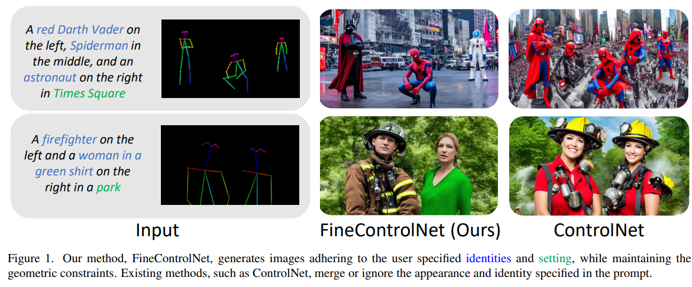
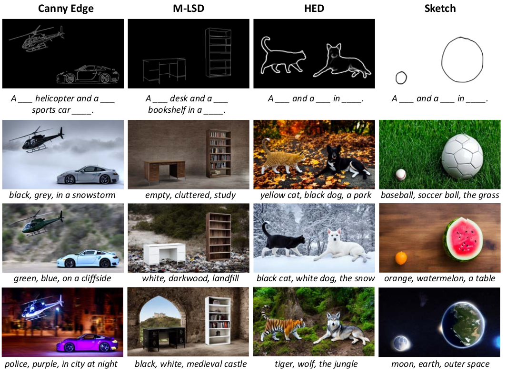
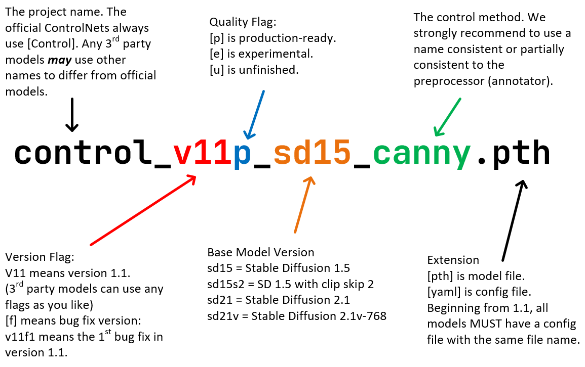

# FineControlNet: Fine-level Text Control for Image Generation with Spatially Aligned Text Control Injection

<!-- 
 -->


# Introduction

This repository is the official [Pytorch](https://pytorch.org/) implementation of the preprint "FineControlNet: Fine-level Text Control for Image Generation with Spatially Aligned Text Control Injection" [[PDF](https://arxiv.org/pdf/2312.09252.pdf)] [[HOMEPAGE](https://samsunglabs.github.io/FineControlNet-project-page/)].

Our implementation is heavily based on [ControlNet1.1](https://github.com/lllyasviel/ControlNet-v1-1-nightly) and [StableDiffusion 1.5](https://stablediffusionapi.com/models/sd-1.5). Great thanks to the contributors!

__Why FineControlNet?__  
🛠 Control the form and texture of the instances image using spatial control input (e.g., 2D human pose) and __instance-specific__ text descriptions.  
🖍 Provide the spatial inputs as simply as a line drawing or as complex as human body poses.  
😃 Ensure natural interaction and visual harmonization between instances and environments.  
🚀 Access the quality and generalization capabilities of Stable Diffusion but with a whole lot of control.  


# Installation

We extend the environment of ControlNet1.1. Please follow below. Currently, We support fine-level text control along with geometric controls of __OpenPose posees, Canny edges, M-LSD lines, HED edges, and skecth (scribble)__.

### Model Specification from ControlNet1.1

Starting from ControlNet 1.1, we begin to use the Standard ControlNet Naming Rules (SCNNRs) to name all models. We hope that this naming rule can improve the user experience.




ControlNet 1.1 include 14 models (11 production-ready models and 3 experimental models):
```
    # 5 models used in our FineControlNet
    control_v11p_sd15_openpose
    control_v11p_sd15_canny
    control_v11p_sd15_mlsd
    control_v11p_sd15_softedge
    control_v11p_sd15_scribble
```

You can download all those models from our [HuggingFace Model Page](https://huggingface.co/lllyasviel/ControlNet-v1-1/tree/main). All these models should be put in the folder "models".

You need to download Stable Diffusion 1.5 model ["v1-5-pruned.ckpt"](https://huggingface.co/runwayml/stable-diffusion-v1-5/tree/main) and put it in the folder "models".

Our python codes will automatically download other annotator models like HED and OpenPose. Nevertheless, if you want to manually download these, you can download all other annotator models from [here](https://huggingface.co/lllyasviel/Annotators/tree/main). All these models should be put in folder "annotator/ckpts". 

To install:

    conda env create -f environment.yaml
    conda activate finecontrolnet

Note that if you use 8GB GPU, you need to set "save_memory = True" in "config.py".

# Demo

Please run,

```
python demo_{name of control}2image.py
```

There are different arguements depending on the control modality. Please refer to each python run file. Test source images and outputs are in `test_imgs` and `test_outputs`, respectively.

Increasing the generation image's resolution and DDIM helps improving the visual quality, which is obvious. Users can also tune image resolution, detection, and so on. Please refer to the code.

# Experiments

## Robustness Study

This is related to the robustness study in our paper's supplementary material. We test robustness of FineControlNet to three factors, namely, "number of people", "distance between people", and "scale of a person". The `./test_imgs/standing.jpg` is used as a pose source and it can be replaced. 

Run
```
python ablation.py --num_persons 3 --person_scale 1.0 --crowdedness 0.0 --seed 12345 --save_dir /path/to/output --img_path ./test_imgs/standing.jpg
```

Users can also tune image resolution, ddim steps, and so on. Please refer to the code.

## Fusion Type

You can choose a fusion type by setting `--fusion_type` arguement. It decides how the latent embeddings of multiple instances are fused during the reverse diffusion process.

```
'h-control': Our FineControlNet
'h-all': Variation of FineControlNet
'h-ediff-i': Our implementation of eDiff-i from NVIDIA adapted to ControlNet
'm': MultiControlNet
'': ControlNet
```

- 'h-control' gives the best identity separation and image quality.
- 'h-all' and 'h-ediff-i' give similar identity separation and image quality. 
- 'h-ediff-i' is memory efficient and fast. Disclaimer: This version has not been tested for compatibility with xformers.
- 'm' is our implementation of MultiControlNet referring to this [repo](https://github.com/huggingface/diffusers/tree/multi_controlnet). It is unstable when there are multiple instances.
- The empty string is the same with ControlNet, just running with the global description.

## Dataset

First finish the environment installation.
Then, refer to [here](./github_docs/curated_dataset.md) to generate our curated dataset, which is modified from the version in our paper to not include any known characters.

## Running Fine-level Text Control with OpenPose poses

Running below command will save generated images in the `save_dir` along with input poses and pose/prompt overlayed images.
```
python run_dataset.py --save_dir /path/to/output --dataset_path /path/to/coco_val_pose_with_prompt_data_finecontrolnet.json
```

## Evaluation

Please refer to [here](./github_docs/evaluation.md). You can find instructions to evaluate different metrics, including CLIP-based similarity scores at the __instance level__.

# Meta information

## Disclaimer

Any content generated by this code repository is/will be algorithmically generated by an AI model trained on a diverse range of data. While the trained models are claimed to involve efforts that have been made to ensure the quality and follow the social agreement, there may be limitations, inaccuracies, or biases present. The content should not be used for any illegal or inappropriate ways that harm the society. We assume no responsibility for any consequences arising from the use of this content.

## Citation

Hongsuk Choi and Isaac Kasahra equally contributed. If you find this work useful, please consider citing:

```
@article{choi2023finecontrolnet,
  title={FineControlNet: Fine-level Text Control for Image Generation with Spatially Aligned Text Control Injection},
  author={Choi, Hongsuk and Kasahara, Isaac and Engin, Selim and Graule, Moritz and Chavan-Dafle, Nikhil and Isler, Volkan},
  journal={arXiv preprint arXiv:2312.09252},
  year={2023}
}
```


