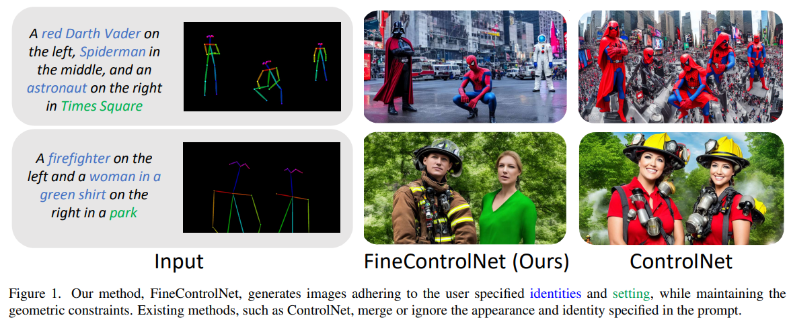
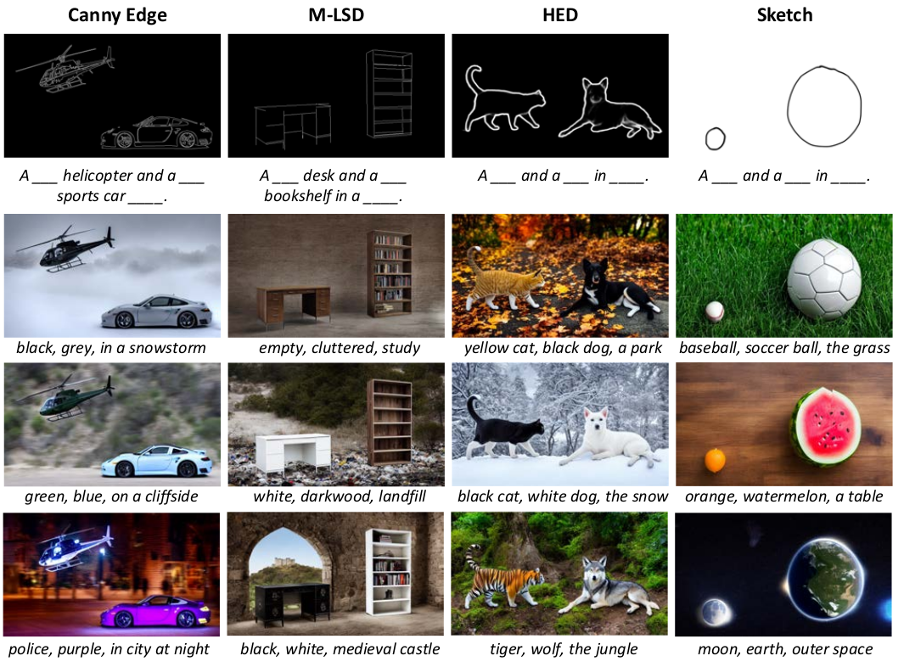

# FineControlNet: Fine-level Text Control for Image Generation with Spatially Aligned Text Control Injection

<!-- 
 -->

# Introduction

This repository is the official [Pytorch](https://pytorch.org/) implementation of the preprint "FineControlNet: Fine-level Text Control for Image Generation with Spatially Aligned Text Control Injection" [[PDF](https://arxiv.org/pdf/2312.09252.pdf)] [[HOMEPAGE](https://samsunglabs.github.io/FineControlNet-project-page/)].

Our implementation is heavily based on [ControlNet1.1](https://github.com/lllyasviel/ControlNet-v1-1-nightly) and [StableDiffusion 1.5](https://stablediffusionapi.com/models/sd-1.5). Great thanks to the contributors!

__Why FineControlNet?__  
🛠 Control the form and texture of the instances image using spatial control input (e.g., 2D human pose) and __instance-specific__ text descriptions.  
🖍 Provide the spatial inputs as simply as a line drawing or as complex as human body poses.  
😃 Ensure natural interaction and visual harmonization between instances and environments.  
🚀 Access the quality and generalization capabilities of Stable Diffusion but with a whole lot of control.  

# News

2023/12/14 - Our preprint is released in arXiv. 
